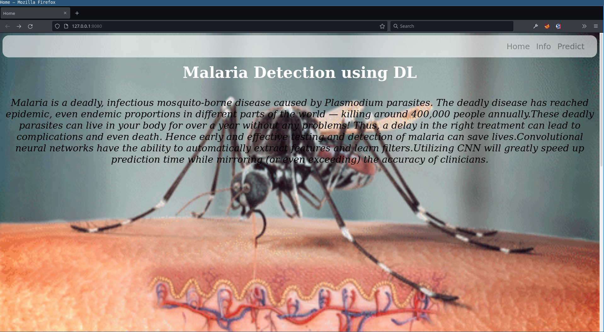
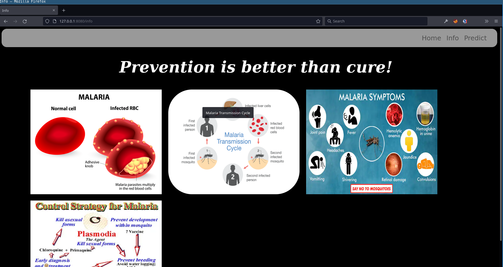
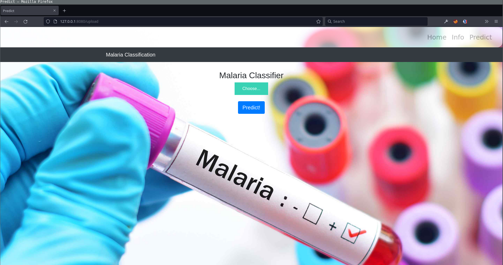
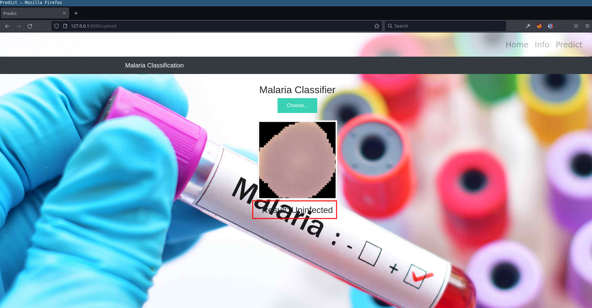
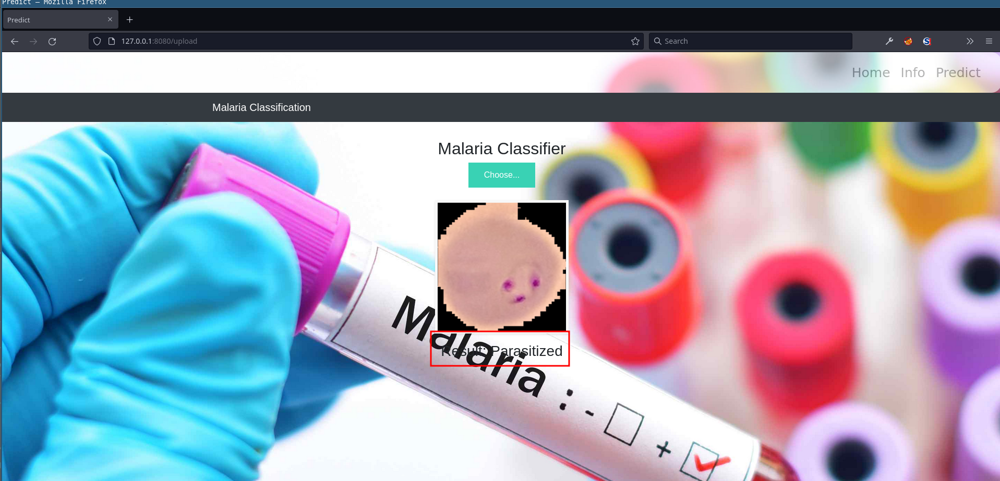

# Implement Deep Learning Techniques to detect Malaria using IBM Cloud

Model trained using Tensorflow and web-app made using flask.

DataSet: [https://www.kaggle.com/iarunava/cell-images-for-detecting-malaria](https://www.kaggle.com/iarunava/cell-images-for-detecting-malaria)

##  Project screenshots

### Home Page

### Info Page

### Detection Page

### Prediction Results

## Demo

Watch the demo video.

OR 

GET the drive link.

